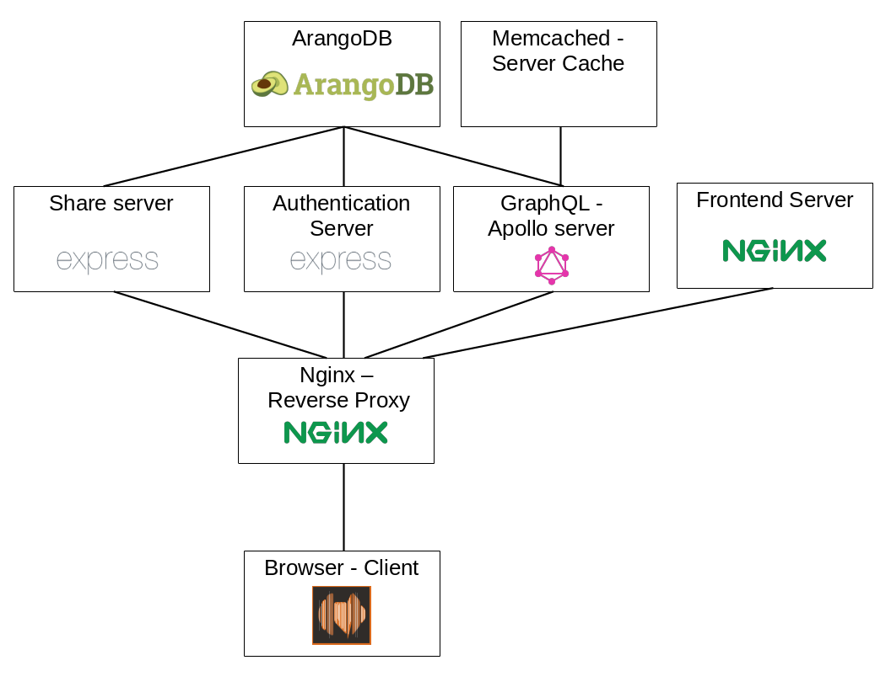

# out-of-tune
Out-of-tune (OOT) is a web application, that utilizes an interactive graph to visualize the world of music.  

Try the live demo here: https://app.out-of-tune.org
## What is the target audience of out-of-tune?
Every developer who is interested in data visualization and analysis should take a look at out-of-tune.
It might inspire them to use a graph-based approach for their own data visualization. 

## Table of Contents
- [out-of-tune](#out-of-tune)
  - [What is the target audience of out-of-tune?](#what-is-the-target-audience-of-out-of-tune)
  - [Table of Contents](#table-of-contents)
  - [Installing out-of-tune](#installing-out-of-tune)
  - [Used Technologies](#used-technologies)
    - [ArangoDB](#arangodb)
      - [Special features](#special-features)
      - [Efficiency](#efficiency)
      - [Evaluation](#evaluation)
    - [GraphQL](#graphql)
    - [VivaGraphJS](#vivagraphjs)
    - [VueJS](#vuejs)
  - [Service Structure](#service-structure)
    - [Reverse proxy](#reverse-proxy)
    - [Frontend Server/Client](#frontend-serverclient)
    - [Caching and Apollo (API)](#caching-and-apollo-api)
    - [Authentication](#authentication)
    - [ArangoDB](#arangodb-1)


## Installing out-of-tune

First you must install:
- Git
- Docker (with docker-compose)


Clone the out-of-tune repository from github.
```
git clone https://github.com/out-of-tune/OOT.git
```

You now have to configure your .env file. The best way to do this is just copy the sample.env file (in the root folder <b>AND</b> in the client folder of the repository) and rename it. 
But first you should enter an Spotify app key and Spotify app secret. You can get one here: https://developer.spotify.com/dashboard/applications  
Follow the instruction and add the key and secret to the .env file.

Now you can start the service by running:
```
docker-compose up --build
```

You will now have to add the CLIENT_KEY and CLIENT_SECRET to the database. To accomplish this, you will have to follow these steps: 
- Connect to the arango database (standard ip: localhost:8529) via browser
- Login with the credentials specified in the .env file
- Go to the correct database (as specified in the .env file)
- Add the following tuple to the APP collection: ```{key: "[CLIENT_KEY from .env]", secret: "[CLIENT_SECRET from .env]"}```

## Used Technologies
For out-of-tune we used many libraries and tools. You can find a full list of the libraries we used in the corresponding package.json files. 

### ArangoDB
ArangoDB is a scalable multi-model database based primarily on document type storage, but has special implementations for graph type documents. Additionally they support characteristics of a key/value database to a limited degree.
They support CRUD, aggregation, complex filters, secondary indexes and JOINs through AQL, their proprietary programming-like query language.
Because ArangoDB is natively a multi-model database any results from traversal, shortest-path, geospatial or just simple CRUD queries can be used directly in another. This allows readable chaining of these different types.
ArangoDB also supports clustering and transactions.

#### Special features
**ArangoSearch** is their natively integrated indexing, text-search and ranking engine. It is optimized for speed and memory:
  - Complex Searches with Boolean Operators
  - Relevance-Based Matching
  - Phrase and Prefix Matching
  - Relevance Tuning on Query-Time

**Geospatial** Queries are queries using latitude/longitude to find documents within a radius or near another. It can also calculate the distance.

#### Efficiency

Although ArangoDB is new and ambitious, it seems to be able to compete performance-wise to the more well-known unrelational databases as seen in their [report](https://www.arangodb.com/2018/02/nosql-performance-benchmark-2018-mongodb-postgresql-orientdb-neo4j-arangodb/). There is a GitHub repository for these tests and they worked together with some people from the teams of the databases it competed with. The transparency of these tests makes this report more powerful.

#### Evaluation

This native multi-model approach is very useful for our usecase, because we primarily use searching and key/value type queries. A smaller, but very notable, amount of relationship queries are used. Those are not very complex and consist only of traversal queries for now.
The ArangoSearch engine will be very useful for text searches.
Although ArangoDB is a new product and not as mature as other unrelational databases is, it is being actively developed and we can expect features and updates.

For a full documentation go to the [Arango database documentation](https://www.arangodb.com/documentation/)
### GraphQL
We use GraphQL as server side interface for communication. All requests from the client go to the graphQL server.  
Apollo is a framework for easy GraphQL usage in JS.
Apollo has both a server and a client module to make and maintain GraphQL backends (as well as querying in the client/frontend). 
In out-of-tune the apollo-server is our main interface to our database. Every request a user sends is sent to apollo. Apollo handles all api calls and returns them as a single  object. 
OOT just uses the apollo backend: The client sends GET/POST requests to the apollo-server and gets a according result. 

For a full documentation go to the [Apollo documentation](https://www.apollographql.com/docs/apollo-server/)
For a full documentation go to the [graphQL documentation](https://graphql.org/learn/)

### VivaGraphJS
We use VivaGraphJS as our core rendering library. It draws all our graphs and provides many of our frontend graph functionalities.   
For a full documentation go to the [VivaGraphJS documentation](https://github.com/anvaka/VivaGraphJS)
### VueJS
Our client side application consists of VueJS as frontend engine in combination with vuex for state management.  
For a full documentation go to the [VueJS documentation](https://vuejs.org/v2/guide/)  
For a full documentation go to the [Vuex documentation](https://vuex.vuejs.org/)

## Service Structure
The service consists of multiple parts. 
In the following image you see the structure as specified in the docker-compose file. The connections represent the communication between the services. 



### Reverse proxy
You see that the client only communicates with the reverse proxy. This is due to security and caching reasons. 
The reverse proxy then sorts out the requests and redirects them to the corresponding service.
You can find a more specific documentation [here](./server/README.md)

### Frontend Server/Client
The frontend service delivers the OOT-client to the browsers. 
You can find a more specific documentation [here](./client/README.md)

### Caching and Apollo (API)
You can find a more specific documentation [here](./api/README.md)

### Authentication
You can find a more specific documentation [here](./auth/README.md)

### ArangoDB
You can find a more specific documentation [here](./db/README.md)
